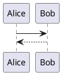

# Мой документ Markdown
## Основы
### Выделение текста
#### Тут совсем маленький заголовок
Добро пожаловать в практическую часть урока по Markdown!
Давайте взглянем на выделение текста

**Lorem ipsum dolor sit amet,** consectetur adipiscing elit, ~~sed do eiusmod tempor~~ incididunt ut labore et dolore magna aliqua. *Ut enim ad minim veniam, quis nostrud exercitation* ullamco laboris nisi ut aliquip ex ea commodo consequat. 
> Duis aute irure dolor in reprehenderit in voluptate velit esse cillum dolore eu fugiat nulla pariatur. Excepteur sint occaecat cupidatat non proident, sunt in culpa qui officia deserunt mollit anim id est laborum.

Вот и все выделение. А что еще нужно?

### Списки
#### Нумерованный список
1. Lorem
2. **ipsum**
3. ~~dolor~~
4. *sit*
5. amet

#### Маркированный список
* Lorem
	* ipsum
	* dolor
* sit
* amet

### Разделитель
------------

### Ссылки
[Есть просто ссылка](http://google.com)
А есть картинка

А есть картинка с ссылкой

### Вставка кода

Код можно вставить внутри строки, как тут: `print("hello world")`

А можно вставить целый кусок кода:

### Таблица
|  Заголовок 1 | Заголовок 2  |
| ------------ | ------------ |
|  Это  |  уже |
| почти  | Excel  |

# ВСЕ!

